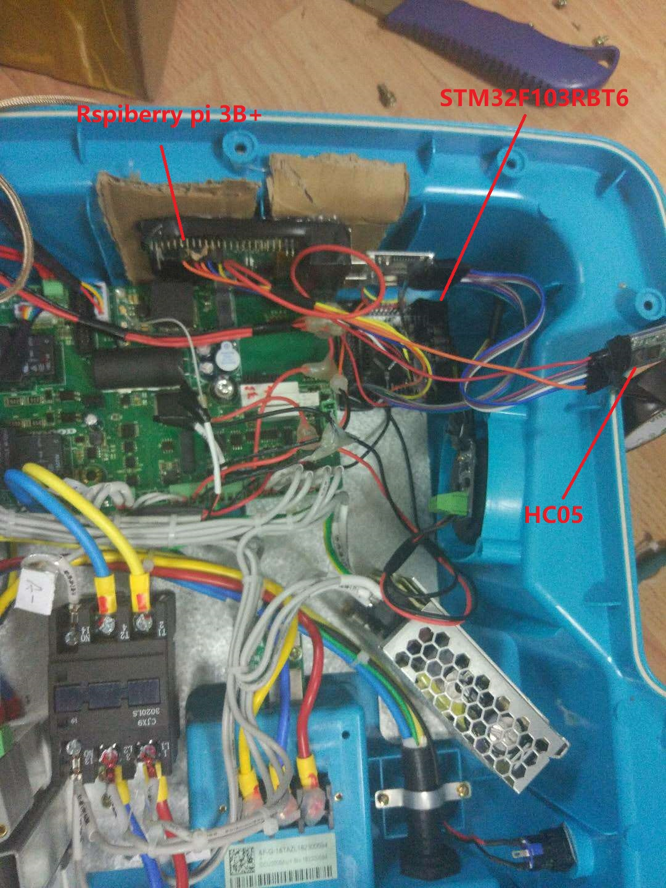
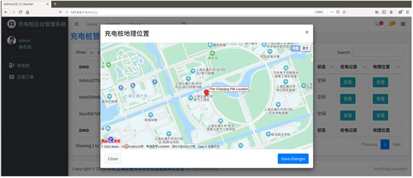
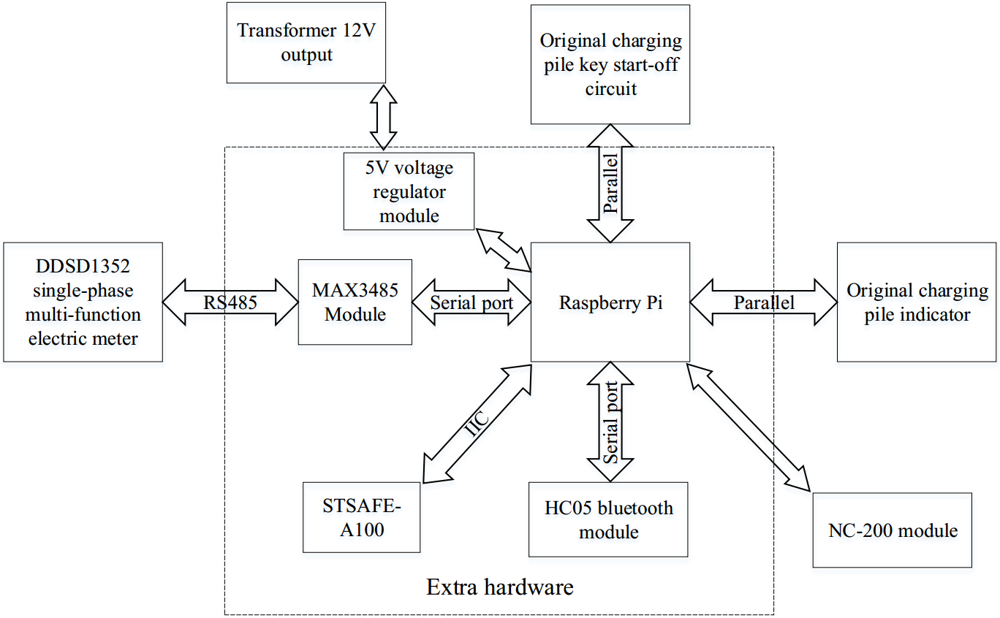
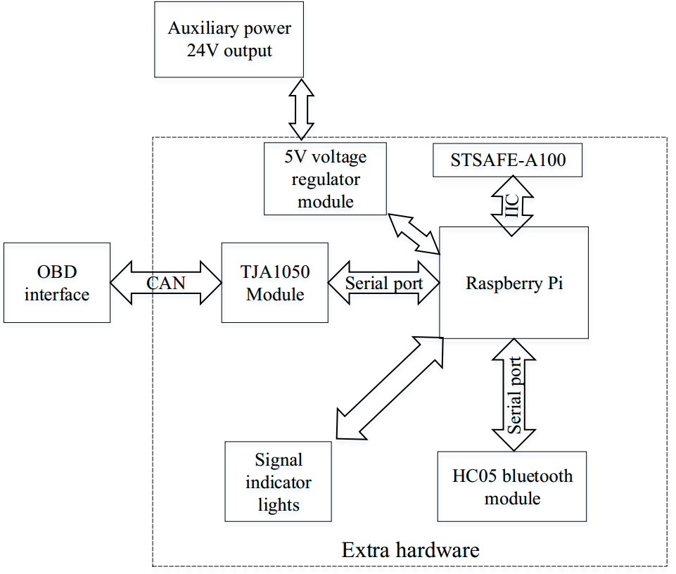

# Charging-payment-system-based-on-blockchain
This is project about charging payment between electrical vehicle (EV) and charging pile (CP) based on blockchain. Both the EV and CP need to add extra devices (raspiberry 3b+), we also build a background management system based on django.

**Charging pile**

There is a python script which can be run in a raspiberry pi 3b+. At first, I use button as the input signal, for example, if you press down one button, which can simulate you plug the gun of charging pile into the electrical vehicle. I also use LED as output signal, for example, if the charging pile starts to charging, it will light the LED. Later, I move the raspiberry pi into a commercial charging pile, I also add a stm32f103rbt6 board as a lower computer to do something such as read the value of electricity meter of charging pile through serial port, and transimit the data processed to raspiberry pi also by serial port. So the raspiberry pi meanly does something about interaction with blockchain, the stm32 works as an middleware between charging pile and raspiberry pi. 
[Demo video](https://www.youtube.com/watch?v=gyWBz0e7cSU)

 

**Charging pile background management system**

I built a background management system based on django and open-source adminLet template.

 

 

**Electrical vehicle**

We designed one occasion at first. If the charging pile is owned by you, when you drive your electrical vehicle close to it, the key authentication will be passed, so you will not be charged. However, if the charging pile is not owned by you, the fee deduction will be happened on blockchain. 

**Hardware modification**

The hardware modification diagrams are as follows, which can be referred.

charging pile

 

 

electrical vehicle

